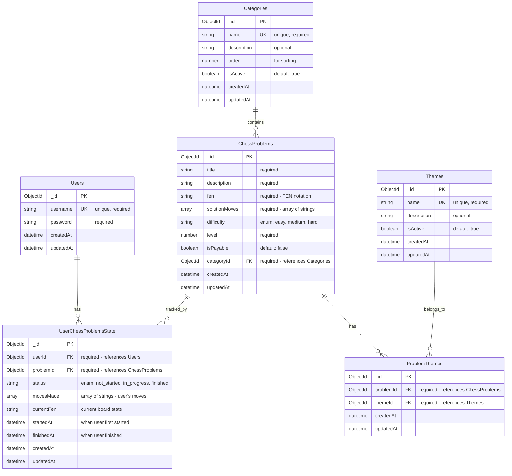

# Chess Database Entity Relationship Diagram

This document describes the database architecture for the chess problem-solving application. The design is extendable and supports multiple categories and themes for chess problems.

## ERD Diagram



## Entity Descriptions

### Users
Stores user account information. Each user can have multiple problem states.

**Key Attributes:**
- `username`: Unique identifier for login
- `password`: Hashed password for authentication

### Categories
Represents problem difficulty categories (e.g., first grade, second grade, third grade, fourth grade, master, national master).

**Key Attributes:**
- `name`: Unique category name
- `order`: Numeric value for sorting categories
- `isActive`: Allows soft-deletion of categories

**Extensibility:** New categories can be added without schema changes.

### Themes
Represents problem themes (e.g., endgame with rooks, mate in 3, mate in 2, mate with knight).

**Key Attributes:**
- `name`: Unique theme name
- `isActive`: Allows soft-deletion of themes

**Extensibility:** New themes can be added without schema changes. A problem can have multiple themes.

### ChessProblems
Stores chess problems with their solutions and metadata.

**Key Attributes:**
- `fen`: Starting position in FEN notation
- `solutionMoves`: Array of moves representing the solution
- `categoryId`: Reference to a single category (one-to-many relationship)
- `difficulty`: Predefined difficulty level
- `level`: Numeric level indicator

**Relationships:**
- Belongs to one Category (via `categoryId`)
- Can have multiple Themes (via ProblemThemes junction table)

### ProblemThemes
Junction table for the many-to-many relationship between ChessProblems and Themes.

**Purpose:** Allows a single problem to have multiple themes while maintaining referential integrity.

**Key Attributes:**
- `problemId`: Foreign key to ChessProblems
- `themeId`: Foreign key to Themes

**Indexes:** Should have a unique composite index on `(problemId, themeId)` to prevent duplicates.

### UserChessProblemsState
Tracks each user's progress and state for each chess problem.

**Key Attributes:**
- `userId`: Reference to the user
- `problemId`: Reference to the problem
- `status`: Enum with values: `not_started`, `in_progress`, `finished`
- `movesMade`: Array of moves the user has made
- `currentFen`: Current board state after user's moves
- `startedAt`: Timestamp when user first started the problem
- `finishedAt`: Timestamp when user finished the problem

**Relationships:**
- Belongs to one User (via `userId`)
- Belongs to one ChessProblem (via `problemId`)

**Indexes:** Should have a unique composite index on `(userId, problemId)` to ensure one state per user-problem combination.

## Relationship Summary

| Relationship | Type | Cardinality | Description |
|-------------|------|-------------|-------------|
| Users → UserChessProblemsState | One-to-Many | 1:N | One user can have multiple problem states |
| ChessProblems → UserChessProblemsState | One-to-Many | 1:N | One problem can be tracked by multiple users |
| Categories → ChessProblems | One-to-Many | 1:N | One category contains multiple problems |
| ChessProblems ↔ Themes | Many-to-Many | N:M | Problems can have multiple themes, themes can belong to multiple problems |
| ChessProblems → ProblemThemes | One-to-Many | 1:N | Junction table relationship |
| Themes → ProblemThemes | One-to-Many | 1:N | Junction table relationship |

## Indexes for Performance

### Recommended Indexes

1. **Users**
   - `username` (unique index - already defined)

2. **Categories**
   - `name` (unique index)
   - `order` (index for sorting)

3. **Themes**
   - `name` (unique index)

4. **ChessProblems**
   - `categoryId` (index for filtering by category)
   - `difficulty` (index for filtering by difficulty)
   - `level` (index for sorting)

5. **ProblemThemes**
   - `(problemId, themeId)` (unique composite index)
   - `problemId` (index for finding themes of a problem)
   - `themeId` (index for finding problems with a theme)

6. **UserChessProblemsState**
   - `(userId, problemId)` (unique composite index)
   - `userId` (index for finding all problems for a user)
   - `problemId` (index for finding all users for a problem)
   - `status` (index for filtering by status)

## Extensibility Features

1. **Categories**: New categories can be added by inserting new records. The `order` field allows custom sorting, and `isActive` enables soft-deletion.

2. **Themes**: New themes can be added by inserting new records. The many-to-many relationship allows problems to be tagged with multiple themes without schema changes.

3. **Status Enum**: The status field in UserChessProblemsState uses an enum. If more statuses are needed in the future, they can be added to the enum definition in the model.

4. **Problem Attributes**: Additional attributes can be added to ChessProblems schema as needed (e.g., hints, time limits, points).

## Query Patterns

### Common Queries

1. **Get problems by category and theme:**
   ```javascript
   // Find problems in a specific category with specific themes
   ChessProblem.find({ categoryId: categoryId })
     .populate('categoryId')
     .populate({
       path: 'themes',
       match: { themeId: { $in: themeIds } }
     })
   ```

2. **Get user's problem states filtered by status:**
   ```javascript
   UserChessProblemsState.find({ 
     userId: userId, 
     status: 'in_progress' 
   }).populate('problemId')
   ```

3. **Get problems with all their themes:**
   ```javascript
   ChessProblem.find()
     .populate('categoryId')
     .populate({
       path: 'themes',
       populate: { path: 'themeId' }
     })
   ```

## Compatibility with Existing Models

The new ERD design is designed to work alongside existing models. Here's how they relate:

### Existing Models

1. **InProgressProblem** (`models/inProgressProblems.js`)
   - **Purpose**: Tracks active game sessions during gameplay
   - **Relationship**: Ephemeral state that can be cleaned up after completion
   - **Coexistence**: Can coexist with `UserChessProblemsState`
   - **Usage**: Used in `GameService` for active game state management
   - **Note**: This model tracks temporary session state, while `UserChessProblemsState` tracks overall progress

2. **ChessSolvedProblemsSnapshot** (`models/chessSolvedProblemsSnapshot.js`)
   - **Purpose**: Stores historical snapshots of completed games
   - **Relationship**: Historical records that persist after game completion
   - **Coexistence**: Can coexist with `UserChessProblemsState`
   - **Usage**: Used to store completion data with timing information
   - **Note**: This model stores historical data, while `UserChessProblemsState` tracks current status

### Model Relationships

```
UserChessProblemsState (Overall Progress Tracking)
    ├── status: not_started, in_progress, finished
    └── Tracks overall user progress per problem

InProgressProblem (Active Session State)
    ├── isCompleted: false (active sessions only)
    └── Used during active gameplay, can be deleted after completion

ChessSolvedProblemsSnapshot (Historical Records)
    ├── solvedAt, timeTakenSeconds
    └── Permanent record of completed games
```

### Migration Considerations

1. **ChessProblems Model**
   - **Current**: Does not have `categoryId` field
   - **Required Change**: Add `categoryId` field to reference Categories
   - **Impact**: Existing problems will need a category assigned during migration

2. **New Models Required**
   - `Categories` - New model to be created
   - `Themes` - New model to be created
   - `ProblemThemes` - New junction table model to be created
   - `UserChessProblemsState` - New model to be created

3. **Data Migration Strategy**
   - Create default categories (first grade, second grade, etc.)
   - Assign existing problems to appropriate categories
   - Create themes and link them to problems via ProblemThemes
   - Initialize UserChessProblemsState records for existing user-problem combinations based on InProgressProblem and ChessSolvedProblemsSnapshot data

### Recommended Implementation Order

1. Create `Categories` model and seed initial categories
2. Create `Themes` model and seed initial themes
3. Update `ChessProblems` model to include `categoryId` field
4. Create `ProblemThemes` junction table model
5. Create `UserChessProblemsState` model
6. Migrate existing data to populate new relationships
7. Update services to use new models alongside existing ones

